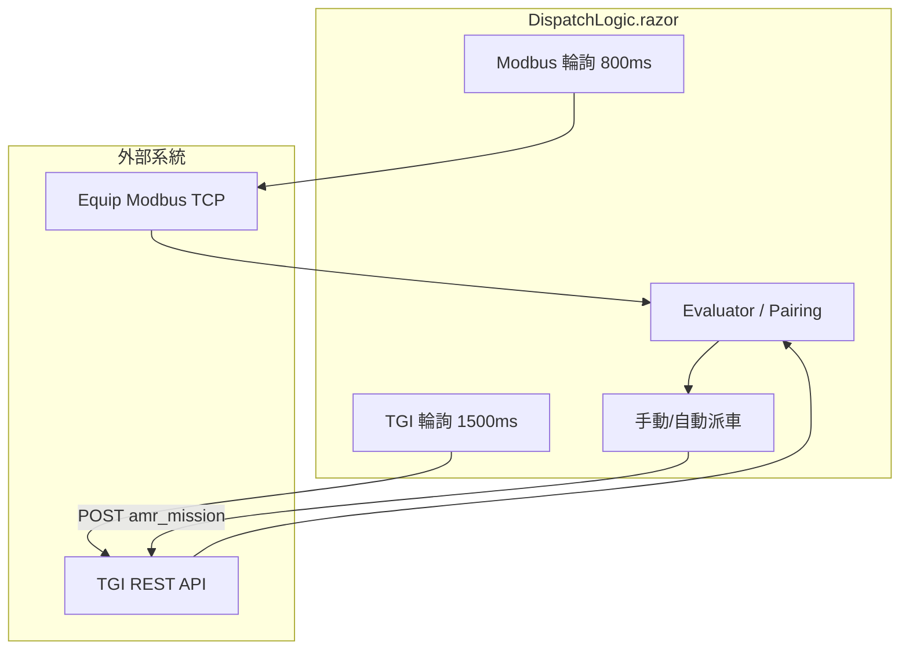

# TG_DispatchLogic_Test2 — Cursor 專案參考文件

> **用途**：供其他 Cursor Agent / 工程師快速理解本專案架構、業務規則、資料來源與修改邊界。  
> **最後整理**：2026-06-23  
> **主程式**：Blazor Server (.NET 8) · 派車邏輯監控與自動/手動派車 UI

---

## 1. 專案目的

本專案是 **台玻 AMR 派車邏輯測試前端**，整合兩類外部資料來源後，依業務規則判斷「何時可派車」，並透過 TGI API 送出 `amr_mission` flow。

| 分頁 | 狀態 | 說明 |
|------|------|------|
| **Buffer 區派車** | ✅ 已實作 | Buffer 滿料 → 空車 Cake 來取料 |
| **撚紗上料派車** | ✅ 已實作 | 滿載 Cake 車 → 撚紗機 3 停車點上料（每組 3 次 flow） |
| **撚紗下料派車** | ❌ Placeholder | 尚未開發 |

**重要邊界**：
- 本程式 **只負責派車決策與 POST flow**，不模擬車輛移動、不直接寫 Modbus。
- 「任務中的派車」與「派車紀錄」是 **本機 UI 追蹤**，一鍵重置 **不會取消 TGI 上已送出的任務**。
- 車隊實際行為由 **TGI-AMR-System** 與 **SimulateCode（Equip 模擬）** 負責。

---

## 2. 技術棧

| 項目 | 選用 |
|------|------|
| Framework | .NET 8, Blazor Interactive Server |
| UI | DevExpress Blazor 24.2.3 |
| 通訊 | HttpClient（TGI REST）、Modbus TCP（Equip 模擬） |
| 設定 | `appsettings.json` |

---

## 3. 外部系統

### 3.1 TGI-AMR-System（AMR 調度）

預設：`http://172.25.90.153:8080`（`appsettings.json` → `AmrApi`）

| API | 用途 |
|-----|------|
| `POST /login/access-token` | 登入取得 Bearer Token |
| `GET /v2/robots/status` | 機器人狀態、Port 料況、`connection_status` |
| `GET /v2/fleets/status` | 車輛 `current_site`（位置、走道准入判斷） |
| `GET /v2/wms` | 等待點 WP 列表 |
| `GET /api/simulation/amrs` | `dispatch_enabled`、`site_code`（**CAKE-11/12 不可派常見原因**） |
| `GET /api/simulation/tasks/active` | TGI 進行中任務（busy 判斷） |
| `POST /v2/flows/amr_mission` | **實際派車**（goal_amr + value_amr） |

**DispatchEnabled 說明**：TGI 預設只開放前 10 台 Cake（`AmrTypeHelper.DemoCakeCount = 10`）。CAKE-11、CAKE-12 需在 TGI **系統設定** 將 Cake 上線台數改為 12，或呼叫 `ConfigureDispatchFleet`。

### 3.2 SimulateCode / Equip 模擬（Modbus）

預設：`172.25.91.143:5020`（Modbus）、`http://172.25.91.143:5189`（SimulateCode API）

| 資料 | 來源 |
|------|------|
| Buffer 12 Port 料況 | Modbus Holding Register |
| 撚紗機狀態（叫車=1） | Modbus `8000 + machineId - 1` |
| 撚紗機各停車點 Cake Port | Modbus（對照 `SimulateCodeParkingCatalogBuilder`） |

### 3.3 相關程式庫位置（工作區外）

- **TGI-AMR-System**：`c:\Users\brian.chen\Desktop\台玻\cursor_workspace\TGI-AMR-System`
- **SimulateCode**：與 Equip 模擬同機，停車點/TWP 規則需與本專案 `SimulateCodeParkingCatalogBuilder` 保持同步

---

## 4. 建置與執行

```powershell
cd TG_DispatchLogic_Test2
dotnet run
# 或避免 exe 被鎖：
dotnet build -o bin/verify_build
```

| 設定 | 值 |
|------|-----|
| 預設 URL | `http://0.0.0.0:5171` |
| 派車頁 | `/dispatch-logic` |
| Development | 不強制 HTTPS 轉址 |

區網其他電腦：`http://<本機IP>:5171/dispatch-logic`

---

## 5. 頁面路由

| 路由 | 檔案 | 說明 |
|------|------|------|
| `/` | `Components/Pages/Index.razor` | 首頁 |
| `/dispatch-logic` | `Components/Pages/DispatchLogic.razor` | **核心派車頁** |
| `/fleet-monitor` | `Components/Pages/FleetMonitor.razor` | 車隊監控 |
| `/api-test` | `Components/Pages/ApiTest.razor` | TGI API 測試 |
| `/equip-sim-test` | `Components/Pages/EquipSimTest.razor` | Modbus 設備模擬檢視 |

---

## 6. 架構與資料流



### 6.1 輪詢節奏（`DispatchLogic.razor` 常數）

| 來源 | 間隔 | 內容 |
|------|------|------|
| Modbus | 800 ms | Buffer + 撚紗機料況、機台狀態 |
| TGI | 1500 ms | robots / fleet / simulation amrs / active tasks |

### 6.2 核心狀態（全在 `DispatchLogic.razor` @code）

| 狀態 | 說明 |
|------|------|
| `_snapshot` | Modbus 最新快照 |
| `_bufferEvaluations` | Buffer 可派評估 |
| `_twpMachineEvaluations` | 撚紗機各側評估 |
| `_cakeVehicles` / `_twpCakeVehicles` | Cake 車可派狀態（Buffer / 上料條件不同） |
| `_pairings` / `_twpPairings` | 配對結果 + 預覽 JSON |
| `_inFlightDispatches` / `_twpInFlightDispatches` | UI 任務追蹤 |
| `_dispatchLogs` / `_twpDispatchLogs` | 派車紀錄 |

---

## 7. Buffer 區派車

### 7.1 可派條件

**Buffer 站**（`BufferDispatchEvaluator`）：
1. 作業面已設定（`OperationSide` = 1 或 2）
2. 作業面 **12 Port 皆有料**（`BufferLiveStation.IsPresent`）
3. 停車點 `BUF00x` **無車停靠**（`fleet.current_site`）

**Cake 車**（`CakeVehicleDispatchEvaluator.Evaluate`）：
1. TGI 有回報、`connection_status = connected`
2. `state = idle`
3. **12 Port 全空**（raw = 0）
4. 無進行中任務（TGI active task + 本機 in-flight）
5. `dispatch_enabled = true`（simulation amrs）
6. 配對時 **優先等待區**（`WP*` 或 fleet 判斷在 wait point）

### 7.2 配對邏輯（`BufferDispatchPairingService`）

- Buffer 依 `StationId` 排序
- 車輛：先 `IsAtWaitingArea`，再依車號
- 一對一配對，組好 `BufferFlowDispatchBuilder` JSON

### 7.3 派車 Flow

| 欄位 | 值 |
|------|-----|
| flow_name | `amr_mission` |
| node_id | `4` |
| artifact_id_amr | `cake_mission` |
| actionid | **4**（Buffer → AMR） |
| goal_amr | `p17@default_area@BUF001` |

一次 POST **1 筆 flow**，12 組手臂任務（run_1~run_12）。

### 7.4 任務完成判定（`BufferDispatchTracker`）

派車後鎖定該 `ParkingPointId`，完成條件（簡化）：
1. 車輛曾進入 busy 狀態
2. 車輛回 idle，且派車時作業面 12 Port 料已取完 **或** 車上 Port 有料
3. 逾時 120 分鐘自動解除鎖定

### 7.5 自動派車

- 模式：`派車模式 → 自動派車`
- 間隔：**20 秒**最多派 1 組（`BufferAutoDispatchIntervalSeconds`）
- 等同手動按第一組可派配對的「派車」

---

## 8. 撚紗上料派車

### 8.1 可派條件

**撚紗機側**（`TwistingLoadDispatchEvaluator`）：
1. 機台狀態 = **叫車（1）**
2. 可走道內湊出至少一組 **尾端往前 3 停車點**，且各點 **4 Cake Port 全空**（待上料）

**Cake 車**（`CakeVehicleDispatchEvaluator.EvaluateForTwistingLoad`）：
1. `idle` + `connected`
2. **12 Port 皆有 Cake 有絲**（raw = 2），至少 12 Port（`PortsPerLoadMission`）
3. 無任務、`dispatch_enabled = true`

### 8.2 停車點分組（`TwistingLoadMissionPlanner`）

- 每側 21 個停車點（seq 1~21），單行道 **由尾端（21）往前**
- 每 **3 停車點** 一組 mission
- 組內 flow 順序：seq 遞增（例：19 → 20 → 21）
- 範例可派組：`TWP01-19 → TWP01-20 → TWP01-21`

### 8.3 優先權（`TwistingLoadLaneAdmission`）

由大到小：
1. **撚紗機**：M01 → M02 → … → M35
2. **同機左右走道**：各 TWP 群組獨立，可同時派各自尾端組
3. **同走道內**：尾端組先派；**前組車輛須 `current_site` 進入該 TWP 走道**（如 `TWP01-19`）才開放後組

其他限制：
- 同機同側最多 **7 組**任務（`MaxConcurrentMissionsPerSide`）
- 停車點已被 in-flight 鎖定則不可重複派

### 8.4 派車 Flow（一組 = 3 次 POST）

| 欄位 | 值 |
|------|-----|
| flow_name | `amr_mission` |
| artifact_id_amr | `cake_mission` |
| actionid | **3**（AMR → 撚紗機上料） |
| 每次 flow | 4 組手臂任務（run_1~run_4 有值，其餘 0） |

**fromport 固定規則**（`TwistingLoadFlowDispatchBuilder.GetAssignedCakeFromPorts`）：

| 停車點序號 (0-based) | 車上 Port |
|---------------------|-----------|
| 0（第 1 停車點） | 1, 2, 3, 4 |
| 1（第 2 停車點） | 5, 6, 7, 8 |
| 2（第 3 停車點） | 9, 10, 11, 12 |

### 8.5 凍結 JSON（重要修正）

配對時透過 `TwistingLoadPairingService.BuildFlowStops` 建好 3 筆 `FlowStops` JSON，存入 `TwistingLoadInFlight.FlowStops`。

派車時 `TryDispatchNextFlowForInFlightAsync` **直接使用凍結的 JSON**，不再重讀 Modbus、不再 `RebuildTwpPair`。

**請勿**在派車迴圈中依「當下有料 port 清單」動態切 fromport，會導致第 2、3 筆 flow 的 fromport 錯誤。

### 8.6 任務完成判定（`TwistingLoadDispatchTracker`）

1. 3 筆 flow 全部 POST 成功
2. 車輛曾 busy
3. 3 個停車點 Cake Port 皆已上料（`NeedsCakeLoad = false`）
4. 車輛回 idle
5. 逾時 120 分鐘解除

### 8.7 自動派車

- 間隔：**10 秒**（`TwpAutoDispatchIntervalSeconds`）
- 對第一組 `CanDispatch = true` 的配對執行 `DispatchTwpPairCoreAsync`（含連續 3 次 flow）
- 派車失敗：5 秒後重試（`TwpDispatchRetryDelaySeconds`）

---

## 9. Cake 車號與 Port 語意

### 9.1 車號

`DispatchFleetCatalog.CakeVehicleCodes`：`CAKE-01` ~ `CAKE-12`

別名互通（`ExpandRobotAliases`）：`CAKE-01` / `Cake-01` / `cake01`

### 9.2 Port 值（車上 / 部分設備）

| 值 | 意義 |
|----|------|
| 0 | 空 |
| 1 | 無絲 |
| 2 | 有絲 |
| 9 | 異常 |

Buffer 料件「有料」：`BufferLiveStation.IsPresent` → raw 低位或高位為 1

### 9.3 撚紗機狀態（Modbus）

| 值 | 標籤 |
|----|------|
| 1 | 叫車 |
| 2 | 請啟動 |
| 3 | 撚紗中 |
| 4 | 請下料 |
| 5 | 空閒 |
| 9 | 異常 |

---

## 10. TWP 走道對照（與 SimulateCode 同步）

規則在 `SimulateCodeParkingCatalogBuilder.GetTwpGroupId`：

| 機台 | A 側 TWP | B 側 TWP |
|------|----------|----------|
| M01 | TWP01 | TWP02 |
| M02~M12 | M_id / M_id+1 | |
| M13 | TWP13 | **TWP14**（M13B 獨立，不與 M14A 共用） |
| M14 | **TWP15** | TWP16 |
| M15~M34 | machineId+1 / machineId+2 | |
| M35 | TWP36 | **TWP37** |

走道範圍：**TWP01 ~ TWP37**（`TwistingParkingRegistry.MaxTwpGroupId = 37`）

停車點 ID 格式：`TWP{群組:D2}-{序號:D2}`，例 `TWP15-21`

---

## 11. Modbus 地址摘要

### 11.1 Buffer（`BufferParkingRegistry`）

- 5 站：BUF001 ~ BUF005
- 每站：base = `1000 + (stationId-1)*40`
- A 側：base ~ base+11；B 側：base+20 ~ base+31
- 作業面暫存器：base+12

### 11.2 撚紗機

- 機台狀態：`8000 + machineId - 1`
- Cake Port：base = `2000 + (machineId-1)*200 + (B側?100:0)` + portIndex
- 詳細對照：執行期由 `SimulateCodeCatalogService` + `SimulateCodeParkingCatalogBuilder` 建立

---

## 12. Flow JSON 結構範例

```json
{
  "args": {
    "priority": "3",
    "params": {
      "4": {
        "goal_amr": "p17@default_area@BUF001",
        "assigned_robot": "Cake-01",
        "artifact_id_amr": "cake_mission",
        "value_amr": "run_1: 1,actionid_1: 4,fromport_1: 1,toport_1: 1,..."
      }
    }
  }
}
```

`value_amr` 由 `BufferFlowDispatchBuilder.BuildValueAmrSlots` 組裝，固定 12 slot。

---

## 13. 檔案對照表（修改時先看這裡）

### 13.1 進入點與設定

| 檔案 | 職責 |
|------|------|
| `Program.cs` | DI、Blazor、HttpClient |
| `appsettings.json` | TGI URL、Modbus、SimulateCode URL |
| `Properties/launchSettings.json` | 本機埠 5171 |

### 13.2 主頁面

| 檔案 | 職責 |
|------|------|
| `Components/Pages/DispatchLogic.razor` | **所有派車 UI、輪詢、自動派車、重置** |
| `Components/Shared/DispatchStatusResetBar.razor` | 一鍵重置（派車模式列右側） |
| `Components/Shared/DispatchBufferPairCard.razor` | Buffer 配對卡 |
| `Components/Shared/DispatchTwistingLoadPairCard.razor` | 撚紗上料配對卡 |
| `Components/Shared/DispatchCakeVehicleView.razor` | Cake 車 Port 明細 |
| `Components/Shared/DispatchTwistingLoadMachineView.razor` | 撚紗機明細 |

### 13.3 業務邏輯（Services）

| 檔案 | 職責 |
|------|------|
| `BufferDispatchEvaluator.cs` | Buffer 可派判斷 |
| `BufferDispatchPairingService.cs` | Buffer 配對 + **CakeVehicleDispatchEvaluator** |
| `BufferFlowDispatchBuilder.cs` | Buffer flow JSON |
| `BufferDispatchTracker.cs` | Buffer 任務追蹤 |
| `TwistingLoadDispatchEvaluator.cs` | 撚紗機可派判斷 |
| `TwistingLoadMissionPlanner.cs` | 3 停車點分組 |
| `TwistingLoadLaneAdmission.cs` | 走道/機台優先權 |
| `TwistingLoadPairingService.cs` | 撚紗配對 + 凍結 FlowStops |
| `TwistingLoadFlowDispatchBuilder.cs` | 上料 flow JSON、fromport 規則 |
| `TwistingLoadDispatchTracker.cs` | 上料任務追蹤 |
| `AmrApiClient.cs` | 所有 TGI HTTP |
| `ModbusEquipPollService.cs` | Modbus 輪詢 |
| `SimulateCodeParkingCatalogBuilder.cs` | TWP/停車點內建對照表 |
| `SimulateCodeCatalogService.cs` | Modbus 暫存器 catalog |

### 13.4 模型（Models）

| 檔案 | 職責 |
|------|------|
| `DispatchFleetCatalog.cs` | CAKE-01~12 |
| `BufferParkingRegistry.cs` | BUF 站 Modbus 佈局 |
| `TwistingParkingRegistry.cs` | 撚紗常數、catalog 入口 |
| `TwistingLoadDispatchModels.cs` | 上料評估/配對/in-flight DTO |
| `BufferDispatchModels.cs` | Buffer 評估 DTO |
| `TriggerFlowModels.cs` | POST flow 請求/回應 |
| `SimulationAmrDto.cs` | dispatch_enabled |
| `RobotStatusDto.cs` | TGI robot status |
| `EquipSimLiveModels.cs` | Modbus 快照 |

---

## 14. UI 操作說明

### 14.1 派車模式

| 模式 | 行為 |
|------|------|
| 手動（先預覽 JSON） | 顯示 JSON，按各組「派車」 |
| 自動派車 | 定時自動派第一組可派配對 |

### 14.2 一鍵重置任務與紀錄

位置：派車模式列右側。

清除項目：
- `_inFlightDispatches` / `_twpInFlightDispatches`
- `_dispatchLogs` / `_twpDispatchLogs`
- 自動派車冷卻計時

**不清除**：TGI 任務、Modbus 狀態。

---

## 15. 常見問題排查

| 現象 | 可能原因 | 處理 |
|------|----------|------|
| CAKE-11/12 顯示 `DispatchEnabled=false` | TGI 只開 10 台上線 | TGI 系統設定 Cake 台數改 12 |
| 車況正常但不可派 | 有 in-flight / TGI active task | 查任務中面板或重置 UI 追蹤 |
| 撚紗配對顯示「需等待開進走道」 | 前組車尚未進 TWP | 查 `fleet.current_site` 是否 `TWPxx-yy` |
| fromport 第 2、3 筆錯誤 | 派車時重算 JSON | 確認使用 `flight.FlowStops[CompletedStops]` |
| Modbus 失敗 | IP/Port/防火牆 | 查 `EquipSim` 設定與 SimulateCode |
| TGI 401 | Token 過期 | 自動重登；查帳密 |

---

## 16. 開發原則（給 Cursor）

1. **先讀再改**：業務規則分散在 Evaluator / Pairing / Tracker / LaneAdmission，改一處要確認上下游。
2. **保持與 SimulateCode 同步**：走道編號、Modbus 地址變更需同時改 `SimulateCodeParkingCatalogBuilder` 與 SimulateCode 專案。
3. **撚紗上料 fromport**：以停車點序號固定映射，配對時凍結 JSON。
4. **最小 diff**：工業現場程式，避免過度抽象；沿用現有 static service 風格。
5. **不擅自 commit**：除非使用者明確要求。
6. **建置驗證**：`dotnet build -o bin/verify_build` 避免執行中 exe 鎖定。

---

## 17. 未實作 / 已知限制

- [ ] 撚紗下料派車（`/dispatch-logic` 第三分頁 placeholder）
- [ ] 一鍵重置不取消 TGI 任務（by design，短期 UI 追蹤）
- [ ] Buffer / 上料任務完成依簡化 heuristic（非訂閱 TGI task callback）
- [ ] `CakeVehicleDispatchEvaluator` 與 `BufferDispatchPairingService` 同檔（歷史原因，重構時可拆檔）

---

## 18. 版本紀錄（摘要）

| 日期 | 變更 |
|------|------|
| 2026-06 | 撚紗上料 fromport 凍結 JSON；artifact 改 `cake_mission` |
| 2026-06 | TWP 走道 M13B→TWP14、M14A→TWP15、範圍至 TWP37 |
| 2026-06 | 自動派車：Buffer 20s、撚紗 10s |
| 2026-06 | 一鍵重置；重置鈕移至派車模式列 |
| 2026-06 | Kestrel `0.0.0.0:5171` 區網可連 |

---

## 19. 快速指令

```powershell
# 建置
dotnet build TG_DispatchLogic_Test2.csproj -o bin/verify_build

# 執行
dotnet run --project TG_DispatchLogic_Test2.csproj

# 搜尋關鍵邏輯
rg "DispatchEnabled|GetAssignedCakeFromPorts|CanDispatchMissionBlock" Services/
```

---

*若業務規則或外部 API 變更，請同步更新本文件與 `SimulateCodeParkingCatalogBuilder` 註解。*
